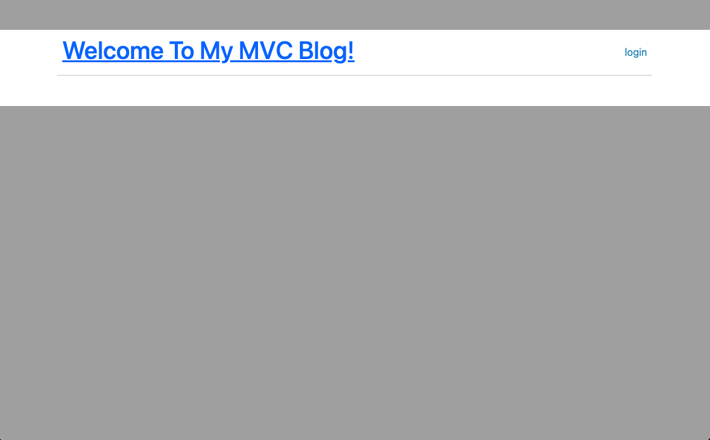

# MVC Blog
  

  ## Description
  
  Use the Model-View-Controller Paradigm to create a blog

  [Heroku Deployed Link](https://mvc-blog11-ce1eaf952466.herokuapp.com/)

  

  ## Table of Contents
  * [Installation](#installation)
  * [Usage](#usage)
  * [License](#license)
  * [Contribute](#contribute)
  * [Testing](#testing)
  * [Questions](#questions)
  
  ## Installation
  You will need to install the following to use this project

  `msql2`, `express.js`, `handlebars.js`

  ## Usage

  The use case for this project is Made blof posts that others can interact with

  ## License

  This Project is licensed under [MIT](https://opensource.org/licenses/MIT)

  ## Contribute

  If you would like the help contribute to this project contact Github

  ## Testing

  To test this project do the following,

  `npm install` then source the msql schema then `npm start`

  ## Questions
  
  For any questions related to this project contact Github 
  You can see more of my work on my Github [Olegreg762](https://github.com/Olegreg762)
